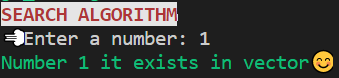
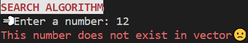

# Algorithms #

Here it is some algorithms that i have been learning in my classes, hope this will be useful in some moment (i think it will 😉). it was implemented with OOP principles. 

### List of Algorithms and your types of implementations ###

## 📌 Search Algorithm ##
 - implemented in recursive method

<p align = 'center'>
    
</p>


<p align='center'>
    
</p>

<P align='center'>
    Sort Algorithms 
</p>

## 📌 Bubble Sort ##

## 📌 Insertion Sort ##

## 📌 Quick Sort ##


😄 Best case: T(N) = N + 2T(N/2)   , and T(1)=0 \
             T(N/2) = N/2 + 2T(N/4) \
    i.e., T(N) = N + 2*(N/2 + 2T(N/4)) \
               = N + N + 4(N/4 + 2(N/8)) \
               = K*N + 2^k*T(N/2^k), for any k \
               For, N/2 = 1 -> k= logN (base 2). I.e., \
    N + 2T(N/2)= N*log N + N*0  \
         T(N)  = N*log N

🤯  Worst case: T(N) = N + T(N-1) \
                T(N) = N + N + (T(N-2)) \
                     = N + N + N + T(N-3) \
                     = k*N + T(N-k), for any K \
                For, T(N-k) = 0 -> N = K. I.e., \
                T(N) = N^2 + 0 
    


```java
@julianasantiago100 | 2 • 0 • 2 • 2
```